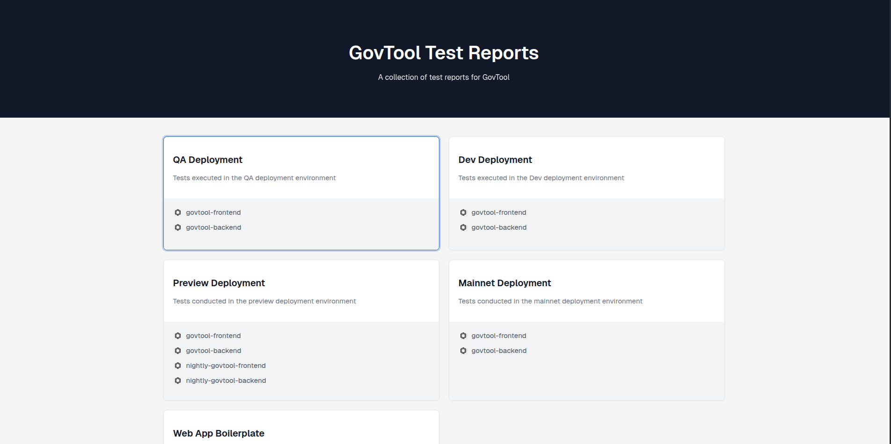

# Govtool Test Reports

This repository hosts Allure test reports generated from the integration and backend test workflows of the [Govtool repository](https://github.com/IntersectMBO/govtool).

## Report Links

- **All Projects**: [https://intersectmbo.github.io/govtool-test-reports/](https://intersectmbo.github.io/govtool-test-reports/)

### QA Environment
- **govtool-frontend**: [https://intersectmbo.github.io/govtool-test-reports/qa/govtool-frontend](https://intersectmbo.github.io/govtool-test-reports/qa/govtool-frontend)
- **govtool-backend**: [https://intersectmbo.github.io/govtool-test-reports/qa/govtool-backend](https://intersectmbo.github.io/govtool-test-reports/qa/govtool-backend)

### Dev Environment
- **govtool-frontend**: [https://intersectmbo.github.io/govtool-test-reports/dev/govtool-frontend](https://intersectmbo.github.io/govtool-test-reports/dev/govtool-frontend)
- **govtool-backend**: [https://intersectmbo.github.io/govtool-test-reports/dev/govtool-backend](https://intersectmbo.github.io/govtool-test-reports/dev/govtool-backend)

### Preview Environment
- **govtool-frontend**: [https://intersectmbo.github.io/govtool-test-reports/preview/govtool-frontend](https://intersectmbo.github.io/govtool-test-reports/preview/govtool-frontend)
- **govtool-backend**: [https://intersectmbo.github.io/govtool-test-reports/preview/govtool-backend](https://intersectmbo.github.io/govtool-test-reports/preview/govtool-backend)
- **nightly-govtool-frontend**: [https://intersectmbo.github.io/govtool-test-reports/preview/nightly-govtool-frontend](https://intersectmbo.github.io/govtool-test-reports/preview/nightly-govtool-frontend)
- **nightly-govtool-backend**: [https://intersectmbo.github.io/govtool-test-reports/preview/nightly-govtool-backend](https://intersectmbo.github.io/govtool-test-reports/preview/nightly-govtool-backend)

### Mainnet Environment
- **govtool-frontend**: [https://intersectmbo.github.io/govtool-test-reports/mainnet/govtool-frontend](https://intersectmbo.github.io/govtool-test-reports/mainnet/govtool-frontend)
- **govtool-backend**: [https://intersectmbo.github.io/govtool-test-reports/mainnet/govtool-backend](https://intersectmbo.github.io/govtool-test-reports/mainnet/govtool-backend)

### Boilerplate
- **web-app-boilerplate**: [https://intersectmbo.github.io/govtool-test-reports/web-app-boilerplate](https://intersectmbo.github.io/govtool-test-reports/web-app-boilerplate)

## Report Structure

### QA Environment
Stores reports from integration and backend tests run in the QA environment.
- **govtool-frontend**: Contains reports from the [integration test workflow](https://github.com/IntersectMBO/govtool/blob/develop/.github/workflows/test_integration_playwright.yml), organized in numbered folders (e.g., `1`, `2`) for latest and historical reports.
- **govtool-backend**: Contains reports from the [backend test workflow](https://github.com/IntersectMBO/govtool/blob/develop/.github/workflows/test_backend.yml), organized similarly.

### Dev Environment
Stores reports from integration and backend tests run in the dev environment.
- **govtool-frontend**: Contains reports from the [integration test workflow](https://github.com/IntersectMBO/govtool/blob/develop/.github/workflows/test_integration_playwright.yml), organized in numbered folders (e.g., `1`, `2`) for latest and historical reports.
- **govtool-backend**: Contains reports from the [backend test workflow](https://github.com/IntersectMBO/govtool/blob/develop/.github/workflows/test_backend.yml), organized similarly.

### Preview Environment
Stores reports from integration and backend tests run in the preview environment.
- **govtool-frontend**: Contains reports from the [integration test workflow](https://github.com/IntersectMBO/govtool/blob/develop/.github/workflows/test_integration_playwright.yml), organized in numbered folders.
- **govtool-backend**: Contains reports from the [backend test workflow](https://github.com/IntersectMBO/govtool/blob/develop/.github/workflows/test_backend.yml), organized similarly.
- **nightly-govtool-frontend**: Contains reports from nightly integration tests run at 12 AM UTC via scheduled [integration test workflow](https://github.com/IntersectMBO/govtool/blob/develop/.github/workflows/test_integration_playwright.yml), organized in numbered folders.
- **nightly-govtool-backend**: Contains reports from nightly backend tests run at 12 AM UTC via scheduled [backend test workflow](https://github.com/IntersectMBO/govtool/blob/develop/.github/workflows/test_backend.yml), organized similarly.

### Mainnet Environment
Stores reports from integration and backend tests run in the mainnet environment.
- **govtool-frontend**: Contains reports from the [integration test workflow](https://github.com/IntersectMBO/govtool/blob/develop/.github/workflows/test_integration_playwright.yml), organized in numbered folders (e.g., `1`, `2`) for latest and historical reports.
- **govtool-backend**: Contains reports from the [backend test workflow](https://github.com/IntersectMBO/govtool/blob/develop/.github/workflows/test_backend.yml), organized similarly.

### Boilerplate
- **web-app-boilerplate**: Contains reports from the [integration test workflow](https://github.com/IntersectMBO/web-app-boilerplate-template/blob/main/.github/workflows/test_integration_playwright.yml) of the [web-app-boilerplate-template](https://github.com/IntersectMBO/web-app-boilerplate-template), organized in numbered folders.

## Projects File
The `projects.json` file defines the folder structure for organizing and displaying reports for `govtool-frontend`, `govtool-backend`, `nightly-govtool-frontend`, `nightly-govtool-backend`, and `web-app-boilerplate` in the UI.

